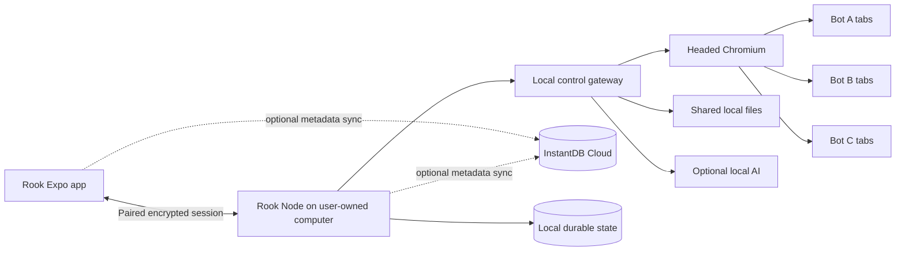

# Rook Node: The Forever-Free Computer Architecture

**Author:** Manus AI  
**Research date:** 20 August 2026  
**Research method:** Eighteen independent investigations covering hosted VMs, containers, decentralized compute, grants, extensions, desktop and mobile devices, peer-to-peer networking, open-source browser stacks, InstantDB synchronization, security, and an adversarial feasibility proof.

## Final decision

Rook should build **Rook Node**: a permanently free, open-source computer runner installed on a computer the user already owns. The user’s computer supplies Chromium, files, browser state, AI tool execution, screen streaming, and human takeover. Rook does not rent a VM, consume browser credits, depend on a trial, attach a payment card, or use a paid relay.

> **The app remains the control surface; the user’s own machine becomes the Bot computer.**

This is the only architecture found that can remain free indefinitely without relying on a company to continue donating compute. Every hosted alternative has a quota, credit, trial, payment method, sleep policy, insufficient resources, or a revocable subsidy. The browser runtime itself is built entirely from open-source components and runs on user-owned hardware.[1] [2] [3]

Rook Node is not a simulation. It runs a real headed Chromium process, gives every Bot its own tabs, retains logins, stores shared files locally, accepts AI actions, and streams the selected Bot screen into the existing Rook interface. The top-right **Computer** button opens that live screen. The user can take control at any time; Rook Node stops Bot input before granting the human lease.

## Selected architecture



The permanent execution path is **Rook app ↔ paired Rook Node ↔ local Chromium**. InstantDB Cloud remains the normal Rook synchronization service, but it is not the only copy of browser profiles, files, pairing keys, or unfinished jobs. Rook Node keeps a complete local state so the computer continues working on the local network if Vercel or hosted InstantDB is unavailable. Users who require total provider independence can self-host the Apache-2.0 InstantDB stack on owned hardware.[4] [5]

## Two permanently free product modes

Both modes are genuinely free of runtime subscriptions. The full mode is the selected implementation; the lighter mode is useful for users who do not want a native runner.

| Approach | User experience and tradeoffs | Cost | Setup complexity |
|---|---|---:|---:|
| **Full Rook Node — selected** | Real headed Chromium, persistent Rook profile, multiple Bot tabs, shared local files, local or remote live screen, human takeover, autostart, optional local AI. Requires an installed runner and a computer that is awake while Bots work. | **No Rook/provider runtime bill.** User supplies existing hardware, electricity, Internet, and disk. | Medium |
| **Rook Browser Extension — lighter alternative** | Controls the user’s already-open Chrome/Edge tabs using `chrome.debugger`; easiest local takeover and login reuse. It cannot control native dialogs or provide the same filesystem and background reliability as the full runner.[6] | **No runtime bill.** Edge listing or unpacked Chrome installation avoids a paid Chrome Web Store account. | Low |

Rook should implement **Full Rook Node first**. The extension can later become a quick-connect mode for users who want Rook to work inside their existing browser.

## Exact component stack

| Component | Selected implementation | Reason |
|---|---|---|
| Desktop host | **Tauri 2** shell with a supervised local sidecar | Tauri supports packaged web UI plus external sidecar binaries and uses permissive MIT/Apache-2.0 licensing.[7] |
| Browser automation | **Playwright + version-pinned Chromium** | Playwright is Apache-2.0, actively maintained, and supplies contexts, pages, locators, screenshots, downloads, and persistent profiles.[1] |
| Bot layout | One user-level Rook browser, one tab group and page registry per Bot | Matches the chosen shared-computer model: Bots share the user’s Rook browser identity and files while retaining separate screens and queues. |
| Strong-isolation option | Separate Chromium profile/process per Bot | Available for Bots that must not share cookies or origin storage; tabs alone are not a security boundary. |
| Live screen | CDP page screencast with screenshot fallback | Sends only the selected page, avoiding a heavy virtual desktop. Rook renders its own address bar, tab strip, cursor, and status UI around the stream.[8] |
| Input | CDP mouse, keyboard, touch, scroll, drag, and text events | Provides precise remote control without exposing raw CDP to the client.[9] |
| Local transport | Encrypted local WebSocket or WebRTC data/media channels | Same-device and same-LAN operation needs no relay or cloud media server. |
| Remote transport | Direct WebRTC when possible; optional user-owned WireGuard/coturn | No Rook-operated relay bill. WebRTC direct connections are not universal, so remote access is conditional on the user’s network or user-owned relay.[10] [11] |
| Files | Local content-addressed workspace with explicit shared and Bot-private folders | Unlimited by a SaaS file quota; browser and model receive opaque file IDs rather than host paths. |
| Durable state | Local SQLite plus encrypted file manifests; mirrored to InstantDB | Local operation survives cloud outages, while InstantDB preserves the current cross-device Rook experience. |
| Optional local inference | `llama.cpp` or Ollama with user-selected open-weight models | Removes any hosted AI dependency for computer planning on capable hardware.[12] [13] |
| Mobile control | Existing Expo app; `react-native-webrtc` in a custom build for direct live control | Provides encrypted media/data channels on iOS and Android; it requires a custom Expo build rather than Expo Go.[14] |

## Shared computer and Bot model

Each Rook account receives one **logical computer** on its selected Rook Node. The runner launches a dedicated Rook Chromium profile, never the owner’s ordinary personal Chrome profile. Chrome explicitly tightened remote-debugging behavior because attackers were using it to steal cookies, and recommends a separate non-default profile for automation.[15]

Within that profile, every Bot receives:

- a stable tab group;
- a primary page and any pop-up pages;
- a durable Bot-to-page registry;
- an independent command queue;
- an input lease;
- a Bot-private file directory;
- access to the explicitly shared Rook workspace.

This matches the shared-computer decision: Bots can use the same logged-in websites and shared files, but their screens and action queues remain separate. Rook can offer a **Private browser identity** switch for a Bot that requires its own cookies and logins; the runner then launches a separate persistent profile/process.

The browser starts automatically when the user signs in to their operating system. On Windows, macOS, and Linux, the runner uses the native login-start mechanism. If the machine sleeps or is powered off, the app honestly shows **Computer offline** and preserves the last checkpoint. When the node returns, it restores Chromium, Bot tabs, local jobs, and file manifests.

## Computer button and live-control UX

Every Bot chat receives a **Computer** icon in the upper-right corner. Pressing it opens a full-screen computer panel for that Bot.

| Interface element | Required behavior |
|---|---|
| Bot identity | Stable avatar, name, and accent colour so the user always knows which Bot screen is open. |
| Connection status | `On this device`, `Local network`, `Direct remote`, `Your relay`, `Restoring`, or `Offline`. |
| Controller status | `Bot controlling`, `You controlling`, `Waiting for approval`, `Paused`, or `View only`. |
| Tab strip | Displays only that Bot’s pages, with title, favicon, loading state, and close/new-tab controls. |
| Address surface | Shows the full origin and URL; navigation to a new origin is clearly surfaced. |
| Files drawer | Shows Shared files and Bot files with upload, download, version, and sharing controls. |
| Take over | Atomically pauses Bot mutations before granting mouse and keyboard input to the user. |
| Return to Bot | Re-observes the page and resumes only after the user explicitly releases control. |
| Stop | Immediately cancels queued actions, releases pressed input, pauses the Bot, and revokes the active control lease. |

Rook supplies its own chrome around the streamed page, so CDP page streaming does not need to capture the operating system, the owner’s desktop, or unrelated applications. Native file pickers and browser permission dialogs are converted into Rook-owned approval UI where possible; irreducible OS prompts require local human action.

## Control and approval protocol

The local runner, not the model and not the frontend, is the execution authority. Every command contains a device ID, user ID, Bot ID, page ID, sequence number, deadline, expected page revision, and requested capability. The runner rejects stale, replayed, cross-user, cross-Bot, or expired commands.

The control lease has four states: `BOT`, `HUMAN`, `PAUSED`, and `NONE`. Only one actor can mutate a page. Human takeover increments a fencing number, cancels queued Bot input, releases keys and mouse buttons, and invalidates every older action. Losing the controller connection leaves the page paused rather than silently returning control to the Bot.

Approvals are bound to the exact action. Reading and scrolling may proceed within policy, while form submission, file upload, messages, account changes, purchases, deletion, security changes, and irreversible actions require explicit approval or human takeover. An approval includes the Bot, real origin, action, recipient or destination, non-secret values, file hashes, page revision, expiry, and one-time nonce. Page content and model output never authorize themselves.

## Files and persistence

Rook Node owns a narrow local workspace:

```text
Rook/
  shared/
  bots/<bot-id>/workspace/
  bots/<bot-id>/downloads/
  bots/<bot-id>/uploads/
  quarantine/
  state/
```

Web pages and AI tools receive opaque file IDs, not arbitrary filesystem paths. The broker normalizes paths, rejects traversal and escaping symlinks, enforces size limits, quarantines downloads, and never exposes the owner’s home directory, SSH keys, password stores, or cloud folders.

Files use immutable versions and hashes. Local SQLite stores paths, ownership, versions, and sharing policy. Hosted InstantDB mirrors metadata and selected encrypted files for the existing Rook experience, but local storage remains canonical for the computer. If a user wants provider-independent synchronization, Rook Node can run self-hosted InstantDB with PostgreSQL and MinIO on that same owned machine; the InstantDB project is Apache-2.0 and publishes a supported self-hosting stack.[4] [5]

Browser recovery uses a dedicated Rook profile plus logical checkpoints: cookies and approved site state, Bot tab URLs/order, workspace manifests, and job progress. Profile and storage-state data are treated as credentials. Playwright warns that saved authentication state can impersonate accounts and must not be committed to source control.[16]

## Networking without a paid relay

Rook Node supports three no-bill connection paths:

1. **Same computer:** the Rook UI talks to the runner over loopback. This is the fastest and most reliable mode.
2. **Same local network:** paired devices connect directly to the runner over authenticated local TLS or WebRTC.
3. **Remote direct/self-hosted:** WebRTC attempts a direct connection. Users with reachable IPv6 or router port forwarding can connect directly; advanced users can operate WireGuard or coturn on their own reachable hardware.[10] [11] [17]

There is deliberately no hidden fallback to a paid or “free-tier” relay. If the user is behind carrier-grade NAT and has no reachable device, remote live control is unavailable; the computer still works locally. The UI reports this clearly instead of charging or consuming credits.

## Distribution without fees

The permanent-free release is **open source and self-hostable**. Users may compile Rook Node or install reproducible self-signed builds. This avoids app stores, paid signing subscriptions, hosted update services, and Chrome Web Store fees. Mainstream operating systems may show a trust warning for self-signed software; Rook provides published hashes, reproducible build instructions, signature verification, and manual trust steps.

Android users can sideload a locally built client or use the web/PWA interface. For iOS, the universal no-fee route is the web/PWA client because durable App Store distribution requires Apple’s paid developer membership.[18] The local computer feature itself does not require an app store.

Updates are signed with a Rook project key and can be downloaded manually from any source or built locally. The node never becomes unusable because an update server disappears.

## Security requirements

A local browser runner is a sensitive endpoint. The implementation must meet the following non-negotiable controls:

- Chromium runs under a dedicated unprivileged user with its sandbox enabled; `--no-sandbox` is forbidden.
- The CDP/Playwright endpoint binds only to loopback or a private process channel and is never returned to the app.
- Each paired client has an Ed25519 device key; pairing requires a short-lived QR code plus confirmation on the node.
- The runner uses replay protection, expiring commands, controller fencing, and immediate revocation.
- Browser content and model output are untrusted data.
- Shared files are mediated by a broker and downloads are quarantined.
- Screenshots are ephemeral and are not recorded by default.
- Secrets live in the operating-system credential store and are filled only for an approved origin.
- The runner blocks loopback, link-local, private-network, router, and cloud-metadata navigation unless a user explicitly creates a local-network capability.
- A local emergency stop always overrides remote control.
- Chromium, Playwright, Tauri, and the operating system are version-pinned, patched, and recoverable.

Playwright’s official container guidance specifically warns against running untrusted websites as root and recommends an unprivileged user plus a seccomp profile.[19] If Rook later supports mutually untrusted accounts on one node, those computers require separate OS users, containers, or virtual machines—not merely separate browser tabs.

## Implementation phases

### Phase 1 — Local computer core

Build the Tauri Rook Node, sidecar supervisor, version-pinned Playwright/Chromium runtime, dedicated Rook profile, Bot tab registry, local SQLite state, shared workspace, screenshots, typed browser actions, and local human takeover. This phase contains no cloud browser and no remote media infrastructure.

### Phase 2 — Rook application integration

Add `computerNodes`, `computerSessions`, `computerTabs`, `computerFiles`, `computerJobs`, `computerEvents`, `computerLeases`, `computerApprovals`, and `pairedDevices` to InstantDB. Use deny-by-default permissions and user-scoped device access. The node uses a user/device credential, never the InstantDB admin token.

Add the top-right Computer button, full-screen panel, tab strip, files drawer, connection states, takeover controls, approval UI, and offline recovery to the Expo app.

### Phase 3 — Direct device pairing

Implement Ed25519 pairing, QR bootstrap, local discovery, authenticated WebRTC, stream/input channels, device revocation, and same-LAN mobile control. Use a custom Expo build for native WebRTC.[14]

### Phase 4 — Remote self-hosted access

Add direct ICE diagnostics and optional user-owned WireGuard/coturn support. Never silently route through a Rook-operated paid relay. Display the actual path—local, direct, or user relay—in the Computer panel.

### Phase 5 — Optional local intelligence

Add a local `llama.cpp` or Ollama computer-use planner behind the existing provider-neutral AI interface. Detect RAM/GPU before downloading a model and retain the existing OpenRouter, OrcaRouter, TokenRouter, and ChatGPT routes as optional user-selected providers. Local inference is the provider-independent fallback, not a forced downgrade for capable cloud-connected users.

### Phase 6 — Acceptance and security testing

Before release, verify browser restart recovery, Bot tab restoration, same-profile sharing, private-profile isolation, file traversal rejection, download quarantine, prompt-injection resistance, stale-command rejection, approval replay rejection, human takeover during navigation, stuck input release, device revocation, node reboot, local network loss, direct-connect failure, and complete offline operation.

## What the wide research ruled out

| Route | Reason it was rejected as the permanent foundation |
|---|---|
| Third-party free VMs | Insufficient RAM/CPU/egress, card-backed overage, trials, revocable allowances, or no production entitlement. |
| Forever-free PaaS | Sleep, ephemeral disks, 0.1 CPU/512 MB class limits, monthly credits, or explicit non-production status. |
| Browser-service federation | Short quotas and session limits; still provider-subsidized and operationally fragmented. |
| Decentralized compute | Akash, Golem, Flux, and Internet Computer require tokens, payments, or metered cycles. IPFS provides storage transport, not Chromium compute. |
| Grants and open-source sponsorship | Finite, discretionary, annually renewed, or technically limited to static sites/registries. |
| GitHub Actions/Codespaces | Quota-bound development infrastructure; not permitted or designed as a production browser service. |
| Pure web page | Same-origin, lifecycle, and permission rules prevent general cross-origin Chromium control. |
| Anonymous volunteer grid | Cannot safely hold private files, cookies, logins, or consequential authority. |
| iPhone/iPad worker | WebKit-only, suspended in background, and durable native distribution requires paid Apple membership. |
| Android worker | Useful spare-device pilot, but background and browser sandbox limitations make it weaker than a desktop node. |
| **User-owned desktop/node** | **Selected. It is the only route with real Chromium capabilities, open-source software, no runtime meter, and no provider subsidy.** |

## Final outcome

Rook can have the requested GrokBot-style computer **forever free of provider charges**. The computer will not live in somebody else’s cloud. It will live on the user’s own Windows, macOS, or Linux computer, where open-source Rook Node runs Chromium, files, browser state, and optional local AI.

This design is permanent because no provider controls its runtime entitlement. It can be used locally even if every hosted free plan changes. The existing Vercel and InstantDB services remain useful synchronization conveniences, while the node is the durable execution authority and local fallback.

The one operational condition is simple and explicit: **the user’s Rook Node must be powered on for their Bots to work.** That is the architecture Rook should now build.

## References

[1]: https://github.com/microsoft/playwright "Microsoft Playwright repository"  
[2]: https://www.electronjs.org/docs/latest/tutorial/security "Electron security guidance"  
[3]: https://github.com/kasmtech/KasmVNC "KasmVNC repository"  
[4]: https://github.com/instantdb/instant "InstantDB open-source repository"  
[5]: https://www.instantdb.com/docs/self-hosting "InstantDB self-hosting"  
[6]: https://developer.chrome.com/docs/extensions/reference/api/debugger "Chrome debugger extension API"  
[7]: https://v2.tauri.app/develop/sidecar/ "Tauri sidecar binaries"  
[8]: https://chromedevtools.github.io/devtools-protocol/tot/Page/ "Chrome DevTools Protocol Page domain"  
[9]: https://chromedevtools.github.io/devtools-protocol/tot/Input/ "Chrome DevTools Protocol Input domain"  
[10]: https://webrtc.org/getting-started/turn-server "WebRTC TURN guidance"  
[11]: https://github.com/coturn/coturn "coturn repository"  
[12]: https://github.com/ggml-org/llama.cpp "llama.cpp repository"  
[13]: https://github.com/ollama/ollama "Ollama repository"  
[14]: https://github.com/react-native-webrtc/react-native-webrtc "React Native WebRTC repository"  
[15]: https://developer.chrome.com/blog/remote-debugging-port "Chrome remote-debugging security changes"  
[16]: https://playwright.dev/docs/auth "Playwright authentication-state security"  
[17]: https://www.wireguard.com/quickstart/ "WireGuard quick start"  
[18]: https://developer.apple.com/support/compare-memberships/ "Apple developer memberships"  
[19]: https://playwright.dev/docs/docker "Playwright Docker security guidance"
